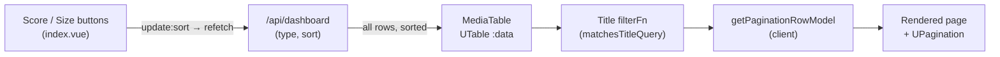

# feat: Convert the dashboard reap table to Nuxt UI UTable with filter + pagination

## Summary

Replace the hand-rolled `<table>` in `app/components/MediaTable.vue` with Nuxt UI's `UTable`
component (TanStack Table under the hood), add a **client-side title quick-filter** and
**client-side pagination**, and preserve every existing behavior: the Reap Score / tier /
rating / size / requested-by / watched-by / reasons cells, the Spare shield action,
row-click-to-open-detail, and the Death-voice empty state.

Sorting stays **server-side** — the existing `/api/dashboard` `sort` param and the Score/Size
buttons in `app/pages/index.vue` are unchanged; the table does not use TanStack's client-side
sort model. The dashboard API already returns every row in one payload, so filter and
pagination operate entirely on that returned set with no API rework.

The dashboard reap table is the only real `<table>` in the app. The People and Settings pages
use card grids and are out of scope.

---

## Problem Frame

`MediaTable.vue` is a bespoke `<table>` with manually written `<thead>`/`<tbody>`, manual sort
headers, and no filtering or pagination. As the library grows, the dashboard renders every
title in a single unpaginated list, and there is no way to jump to a title by name. The user
wants the table moved onto Nuxt UI's `UTable` (TanStack) foundation, with pagination and, at
minimum, a filter by title.

The move is a **presentation-layer refactor**: the `/api/dashboard` contract, the row data
shape, and the domain vocabulary (`reapScore`, `spared`, `tier`) are unchanged.

---

## Requirements

- **R1** — Render the dashboard reap table with Nuxt UI `UTable` (TanStack Table), not a
  hand-rolled `<table>`.
- **R2** — Provide client-side pagination over the returned rows.
- **R3** — Provide a quick filter that matches the **title** (case-insensitive substring). Title
  is the confirmed scope; broader fields (requested-by, reasons) are explicitly out.
- **R4** — Preserve all current behavior with no visual or functional regression: every cell
  (score/tier badge, title+year, rating, seasons for series, size, requested-by + age,
  watched-by badges, last-watched, reason tags, Spare action), row-click opens `TitleDetail`,
  the Spare shield toggles without triggering row-click, spared rows read as dimmed/pinned, and
  the empty state keeps Death's voice.
- **R5** — Keep sorting **server-side**: the `sort` query param (`score` \| `size`) and the
  page-level Score/Size controls continue to drive order; the table itself does not sort.
- **R6** — `MediaTable`'s public interface (`rows`, `type`, `sort` props; `update:sort`,
  `select`, `spare` emits) stays stable so `app/pages/index.vue` needs no behavioral change.

---

## Key Technical Decisions

**Cell rendering via per-column slots, not `h()` render functions.** The current cells are rich
(nested badges, tooltips, conditional markup). Nuxt UI `UTable` supports per-column template
slots (`#<column-id>-cell="{ row }"` and `#<column-id>-header`), which let the existing template
markup carry over almost verbatim instead of being rewritten as verbose `h()` trees. Columns are
defined minimally (`accessorKey`, `header`, `meta.class` for alignment); the visual body lives in
slots. *(Confirm the exact slot-name syntax against the installed `@nuxt/ui` v4.9 at
implementation time — see Risks.)*

**Server-side sort, client-side filter, client-side pagination.** These three stages compose in
that order (see High-Level Technical Design). Sort is owned by the API and the page controls;
filter and pagination are TanStack row models layered on the already-sorted payload. This matches
the confirmed decisions and avoids any `/api/dashboard` change.

**Title filter as a testable pure predicate.** The filter logic is extracted into a small
`app/utils` helper (`matchesTitleQuery`) and unit-tested in the node environment, matching the
repo's existing `test/unit/**` culture. `UTable`'s title column uses a custom TanStack `filterFn`
that delegates to this helper, so the wiring is thin and the logic is covered without adding
component-test tooling.

**Per-row "spared" dimming via cell-level class, not row-level.** TanStack cell `meta.class` is
static per column, and `UTable` does not expose a straightforward per-row conditional class. The
existing `opacity-60` treatment for spared rows is reproduced by conditioning cell content on
`row.original.spared` inside the slots (the score/reasons cells already branch on `spared`). This
is a deliberate constraint accommodation, not a visual change.

**Row-click via `UTable`'s row-select event.** Row-click-to-open-detail is wired through
`UTable`'s row selection/`@select` event rather than a manual `@click` on `<tr>`. The Spare
button in the actions cell must stop propagation (`@click.stop`) so sparing never also opens the
detail panel. *(Confirm the exact event name/signature against v4.9 — see Risks.)*

---

## High-Level Technical Design

Directional view of where each stage of the row pipeline executes. Prose above is authoritative.



- **Server:** sort order (`sort` param) — refetch on Score/Size toggle.
- **Client (table):** title filter → pagination → render. Changing the filter resets to page 1
  (TanStack `autoResetPageIndex` default) and `UPagination` totals reflect the filtered row count.

---

## Implementation Units

### U1. Extract and unit-test the title-filter predicate

**Goal:** A pure, node-testable helper that decides whether a title matches a filter query, ready
to plug into the table's column `filterFn`.

**Requirements:** R3.

**Dependencies:** none.

**Files:**
- `app/utils/format.ts` — add `matchesTitleQuery` (or a new `app/utils/table.ts` if preferred;
  keep it alongside the other presentation helpers).
- `test/unit/table-filter.test.ts` — new unit test.

**Approach:** `matchesTitleQuery(title: string, query: string): boolean` — trims the query,
returns `true` for an empty/whitespace query, and otherwise does a case-insensitive substring
match. Keep it dependency-free so it runs under the existing `environment: 'node'` Vitest config.

**Patterns to follow:** the existing pure helpers in `app/utils/format.ts` (`formatBytes`,
`timeAgo`) and their sibling unit tests in `test/unit/` (e.g. `test/unit/detail-links.test.ts`).

**Test scenarios** (`test/unit/table-filter.test.ts`):
- Empty query (`''`) returns `true` for any title (no filter applied).
- Whitespace-only query (`'   '`) returns `true`.
- Case-insensitive match: `matchesTitleQuery('The Sandman', 'sand')` is `true`.
- Substring anywhere: query matching mid-title (`'man'` in `'The Sandman'`) is `true`.
- Non-match: `matchesTitleQuery('The Sandman', 'xyz')` is `false`.
- Leading/trailing whitespace in query is trimmed before matching (`' sand '` matches
  `'The Sandman'`).

**Verification:** `npm test` passes with the new file; the helper is exported and importable.

---

### U2. Rebuild MediaTable on UTable with full behavioral parity (no filter/pagination yet)

**Goal:** Replace the hand-rolled `<table>` with `UTable`, reproducing every cell, the
server-side sort headers, row-click, the Spare action, spared dimming, and the empty state —
with `MediaTable`'s props/emits unchanged.

**Requirements:** R1, R4, R5, R6.

**Dependencies:** none (U1 not required until U3).

**Files:**
- `app/components/MediaTable.vue` — rewrite the template/script to use `UTable`; keep the
  existing `defineProps` (`rows`, `type`, `sort`) and `defineEmits` (`update:sort`, `select`,
  `spare`) exactly.

**Approach:**
- Define `columns: TableColumn<Row>[]` with `accessorKey` for `reapScore`, `title`, `rating`,
  `seasonCount` (series only — include conditionally on `type`), `sizeOnDisk`, `requestedBy`,
  `watchedBy`, `lastWatchedAt`, `reasons`, plus an `id: 'actions'` column. Use `meta.class` for
  right-alignment and mono/tabular numerics where the current cells have them.
- Render each cell with a `#<column-id>-cell="{ row }"` slot, moving the existing badge/tooltip
  markup over largely verbatim and reading fields from `row.original`.
- Reap Score and Size headers render via `#<id>-header` slots as the existing buttons that emit
  `update:sort` (`'score'` / `'size'`) and show the active-sort arrow from the `sort` prop —
  preserving server-side sort. Other headers are plain labels.
- Wire row-click to emit `select(row.original.id)` through `UTable`'s row-select event; the
  actions-cell Spare button keeps `@click.stop` and emits `spare({ id, title, spared: !spared })`.
- Reproduce spared dimming by binding `:class="{ 'opacity-60': row.original.spared }"` on cell
  content (see Key Technical Decisions).
- Move the empty state into `UTable`'s `#empty` slot, keeping the `VoiceLine` copy
  ("There is nothing here to reap.").

**Technical design (directional, not implementation spec):**
```
UTable :data="rows" :columns="columns"
  #reapScore-header  -> button emits update:sort('score'), arrow if sort==='score'
  #reapScore-cell    -> spared? Spared badge : score badge + tier badge
  #title-cell        -> title (font-medium) + year (text-xs muted)
  #size-header       -> button emits update:sort('size'), arrow if sort==='size'
  #actions-cell      -> UTooltip + UButton(shield) @click.stop emits spare
  #empty             -> VoiceLine "There is nothing here to reap."
@select -> emit('select', row.original.id)
```

**Patterns to follow:** Nuxt UI `UTable` column/slot patterns (see Sources); existing badge/color
helpers `scoreColor`, `tierMeta`, `ratingColor`, `formatBytes`, `timeAgo` from
`app/utils/format.ts` — reuse as-is.

**Test scenarios:** `Test expectation: none -- presentational UTable wiring; the repo has no
component-test harness and adding one is out of scope (confirmed). Parity is checked via
typecheck and manual verification below.`

**Verification:** `npm run typecheck` passes; running the app (`npm run dev`), the dashboard
renders all columns for both Series and Movies tabs identically to before; Score/Size buttons
still reorder via server refetch; clicking a row opens `TitleDetail`; the Spare shield toggles
without opening the detail; spared rows appear dimmed; emptying the data shows the Death-voice
empty state.

---

### U3. Add title quick-filter and client-side pagination

**Goal:** A filter input (title) and a pagination control operating client-side on the returned
rows, using the U1 predicate for filtering.

**Requirements:** R2, R3.

**Dependencies:** U1, U2.

**Files:**
- `app/components/MediaTable.vue` — add the filter input, pagination state, `UPagination`, and
  the pagination row model to the `UTable` from U2.

**Approach:**
- Add a `UInput` (placeholder e.g. "Filter by title…", `i-lucide-search` icon) in a toolbar row
  above the table, inside `MediaTable` so the component stays self-contained. Bind it to the
  `title` column's filter value (`v-model:column-filters`, or drive
  `tableApi.getColumn('title')?.setFilterValue()`), and give the `title` column a custom
  `filterFn` that delegates to `matchesTitleQuery(row.getValue('title'), value)`.
- Enable client-side pagination: `v-model:pagination` (default `pageSize` 25),
  `:pagination-options="{ getPaginationRowModel: getPaginationRowModel() }"` (imported from
  `@tanstack/vue-table`), and an external `UPagination` bound to the table API
  (`page`, `items-per-page`, `total` from `getFilteredRowModel().rows.length`,
  `@update:page → setPageIndex`).
- Ensure the empty state still fires when the filter matches nothing (the `#empty` slot renders
  on an empty filtered set) — keep the Death-voice copy.

**Technical design (directional):**
```
toolbar: UInput(title) -> tableApi.getColumn('title').setFilterValue(q)
UTable   v-model:pagination + getPaginationRowModel()
footer:  UPagination total=getFilteredRowModel().rows.length @update:page=setPageIndex(p-1)
column 'title': filterFn = (row,_id,value) => matchesTitleQuery(row.getValue('title'), value)
```

**Patterns to follow:** the Nuxt UI "client-side pagination" and "column filters" table recipes
(see Sources); the U1 helper.

**Test scenarios:** `Test expectation: filtering logic is covered by U1's unit tests
(matchesTitleQuery). The input↔filterFn↔pagination wiring is presentational and verified
manually — no component-test harness in this repo (confirmed).` Manual checks:
- Typing a title substring narrows the visible rows; clearing the input restores all rows.
- Filtering to zero matches shows the Death-voice empty state.
- With more rows than the page size, `UPagination` appears and pages through; the total reflects
  the **filtered** count, and changing the filter resets to page 1.
- Switching Series/Movies tab or toggling Score/Size (server refetch) leaves the table paginating
  and filtering the new payload correctly.

**Verification:** `npm run typecheck` and `npm test` pass; manual checks above hold in `npm run dev`.

---

## Scope Boundaries

**In scope:** `app/components/MediaTable.vue` (dashboard reap table) converted to `UTable` with
client-side title filter and client-side pagination; a unit-tested title-filter helper.

**Out of scope (not tables):** the People page (`app/pages/people.vue`, `PersonCard` grid) and
Settings pages — they use card layouts, not `<table>`, and the user did not ask to change them.

### Deferred to Follow-Up Work
- Broadening the quick filter to also match requested-by, watched-by, or reason tags (a global
  filter). Confirmed title-only for now.
- Making non-sort columns (rating, requested-by, last-watched) sortable — would require either
  new server `sort` values or a shift to client-side sorting; sorting is server-side by decision.
- A page-size selector (fixed page size for now).
- Server-side pagination — unnecessary while `/api/dashboard` returns the full set; revisit only
  if the library grows large enough that shipping all rows becomes a payload concern.
- Persisting/resetting the filter across tab switches — current behavior (filter persists) is
  acceptable; revisit if it feels wrong in use.

---

## Risks & Dependencies

- **`UTable` slot/event API drift (medium).** The exact per-column slot-name syntax
  (`#<id>-cell` / `#<id>-header`), the row-select event name/signature, and the pagination
  `v-model` shape must be confirmed against the installed `@nuxt/ui` **v4.9** rather than assumed.
  Mitigation: verify against the installed package's table docs/types during U2/U3; the
  Context7-sourced examples (see Sources) reflect the v4 line and are the working reference.
- **`@tanstack/vue-table` import (low).** `getPaginationRowModel` is imported from
  `@tanstack/vue-table`, which ships transitively with `@nuxt/ui`. If it is not directly
  resolvable, it may need to be added as an explicit dependency. Confirm at U3.
- **Per-row conditional styling (low).** Spared-row dimming is handled at the cell level by
  design (see KTD); if a cleaner row-level hook exists in v4.9, prefer it, but the cell-level
  approach is the guaranteed fallback.
- **No component-test safety net (accepted).** Parity for the presentational rewrite rests on
  typecheck + manual verification by decision; only the extracted predicate is unit-tested.

---

## Sources & Research

- Nuxt UI `UTable` — client-side pagination (`v-model:pagination`,
  `getPaginationRowModel`, external `UPagination` bound to `tableApi`), column definitions with
  custom `cell`/`header`, global and per-column filtering (`v-model:column-filters`,
  `getColumn(id).setFilterValue()`), and row actions. Fetched via Context7 (`/llmstxt/ui_nuxt`
  full docs) on 2026-07-02; corresponds to `https://ui.nuxt.com` table documentation.
- Installed stack (from `package.json`): `@nuxt/ui` ^4.9.0, `nuxt` ^4.4.8,
  `tailwindcss` ^4.3.1, Vitest ^3.2.4 (node environment, `test/unit/**`).
- Existing code referenced: `app/components/MediaTable.vue`, `app/pages/index.vue`,
  `app/utils/format.ts`, `server/api/dashboard.get.ts`, `server/utils/dashboard.ts`.
