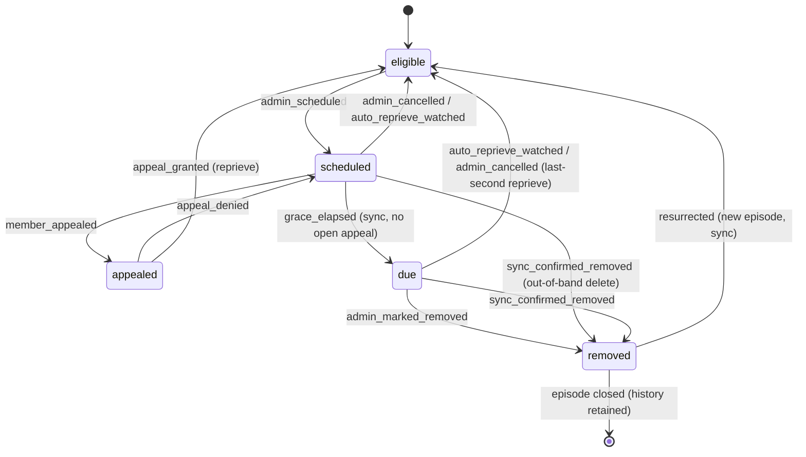

# feat: Reaping Workflow (M1) — schedule → grace → appeal → removal lifecycle

**Date:** 2026-07-02
**Type:** feat · **Depth:** Deep
**Origin:** Reaping Workflow feature spec v0.1, resolved in the `/grill-with-docs` session on 2026-07-02.
Companion domain docs: root `CONTEXT.md`, `docs/adr/0001`–`0006`.

---

## Summary

Add the **Reaping Workflow** — a grace-period / stay-of-execution lifecycle on top of today's
read-only reap-candidate list. The operator **schedules** a stale title; a clock runs; **all
members** are emailed and may **appeal**; watching the title during the window **auto-reprieves**
it; when grace elapses the sync flips it to **due**; the operator actions removal by clicking
through to Sonarr/Radarr (Reaparr never deletes); the next sync **confirms** it is gone,
**tombstones** the row (history retained), and closes the episode. A title that returns later
matches on its external id, **resurrects** as a new episode, and re-scores fresh.

**M1 is operator-driven** — there is no auth yet, so the operator records appeals on a member's
behalf. **M2** (a separate plan) adds Sign in with Plex + member self-service appeal + Discord
broadcast. This plan is M1 only.

The single load-bearing change is the **sync reconciliation rework**: `persistTitles()` currently
*hard-deletes* any title missing from the *arr pull (cascading away score/watchers/history) and
would wipe everything on a failed fetch. M1 makes `title` a soft-delete/tombstone table and adds a
success-guard, which both enables the episode/resurrection model and fixes a latent mass-wipe bug.

---

## Problem frame

Reaparr ranks stale titles (Reap Score ≥ 50 = reclaimable) but stops there — the operator has no
supported path from "flagged" to "gone", and members get no say before a title they care about is
removed. Today the only lifecycle signal on a title is the `spared` boolean; there is no notion of
"scheduled for removal", no countdown, no appeal, and no record of *how* a title reached its current
state. Meanwhile the daily sync treats any title absent from Sonarr/Radarr as deletable and rebuilds
tables from scratch, so there is nowhere for a removal to leave a durable trace and no way for a
returning title to reclaim its history.

---

## Decision index → where each resolved decision lives

| Spec decision (grilling outcome) | Realized in |
|---|---|
| D1 Sync reconcile = tombstone-all + fetch-guard | U1, U4 · ADR-0002 |
| D2 Audience = all members; operator included | U3, U5 · ADR-0004 |
| D3 M1 operator-driven; Plex auth deferred to M2 | Scope boundaries · ADR-0006 |
| D4 Grace = global default (7d) + per-schedule override, whole-days | U1, U6 |
| D5 Appeal is binary, no reason codes; blocks at the Appointed Hour | U2, U6 · ADR-0005 |
| D6 Resolution binary accept/deny; sparing stays separate | U2, U6 · ADR-0005 |
| D7 Due flip = stored transition on sync (`grace_elapsed`, actor=system) | U5 · ADR-0001 |
| D8 Auto-reprieve on any play during grace | U5 · ADR-0005 |
| D9 No cool-off in v1 | U2 (reprieve → eligible immediately) |
| D10 Notify on schedule/reprieve/departed; reminder opt-in per-schedule | U3, U5, U6 · ADR-0004 |
| D11 Departed always notifies; out-of-band delete → sync_confirmed_removed | U4, U5 · ADR-0004 |
| Append-only transition log, separate from notification ledger | U2, U3 · ADR-0003 |

---

## Key technical decisions

- **KTD-1 — Lifecycle state is a denormalized column on `title`, backed by an append-only log.**
  Add `state` (default `'eligible'`) to `title`; the authoritative history lives in a new
  `title_transition` table. `title.state` always equals the latest transition's `to_state`. Mirrors
  the existing "flag on `title`" pattern (`spared`, `person.isMember`). Voice labels (The Sands /
  Appointed Hour / Departed) are **not** stored — they are a frontend copy map (ADR-0001).
- **KTD-2 — `title` becomes a tombstone table; the sync stops hard-deleting.** Absent titles are
  soft-closed (`removed_at` set, `state='removed'`, rows retained) rather than deleted. A
  **fetch-guard** ensures a failed/empty source never triggers removals. Resurrection matches on
  `tmdb_id`/`tvdb_id`, reactivates the row, and increments `episode` (ADR-0002).
- **KTD-3 — Additive schema only, via the established `ensureColumns()` path.** Every new column is
  added in three places in lockstep: `server/db/schema.ts`, `BOOTSTRAP_SQL` and the `ensureColumns`
  add-list in `server/db/client.ts`. New tables get Drizzle defs + `CREATE TABLE IF NOT EXISTS`.
- **KTD-4 — Actor model: nullable person FK + system enum, exactly one populated.**
  `title_transition.actor_person_id` (FK) for human actions; `actor_system` (`sync`|`system`) for
  non-human ones. Enforced at the application layer in the state-machine module (ADR-0003).
- **KTD-5 — `Notifier` is an interface from day one; M1 ships only `EmailNotifier`.** Per-recipient
  fan-out over the `is_member` list; the broadcast shape (Discord) is defined but unimplemented so
  M2 drops in without touching the state machine. Every send is logged to `reaping_notification`
  for idempotency (ADR-0004).
- **KTD-6 — Email transport is behind the `Notifier` seam and pluggable.** Default to **SMTP via
  `nodemailer`** (config in `source_connection`/`app_setting`); the transport is swappable without
  touching callers. A no-op/log transport is the fallback when unconfigured so the workflow never
  blocks on mail.
- **KTD-7 — Sparing stays a separate function.** Granting an appeal → reprieve (→ `eligible`), and
  **never** sets `spared`. Permanent keep remains the existing Spare action; `spared`/`spared_at`
  are untouched by this workflow (ADR-0005).
- **KTD-8 — No cool-off in v1.** A reprieved title re-enters the candidate pool immediately; the
  reprieve is captured only as a transition-log row. No `reprieved_at` column.
- **KTD-9 — Read-only boundary preserved.** No delete call to Sonarr/Radarr anywhere; removal is the
  operator's click-through, and Reaparr only records intent and reconciles on sync.

---

## High-level technical design

State machine (functional names; voice is display-only). `reprieve` and `resurrected` are
transitions, not persistent states.



Sync tick ordering each run (after `persistTitles`): **reconcile** (fetch-guard → soft-close absent
→ resurrect returned) → **due flip** (`scheduled`→`due` where `due_at ≤ now` and no open appeal) →
**auto-reprieve** (any watch inside `[scheduled_at, due_at]`) → **reminders** (opted-in titles ~1
day before `due_at`) → **discrepancy nudge** (marked-removed but still present).

---

## Output structure (new `server/reaping/` module)

```
server/reaping/
  stateMachine.ts   # allowed transitions, applyTransition(), actor invariant
  schedule.ts       # schedule / cancel / extend (single + bulk)
  appeal.ts         # raise / withdraw / grant / deny (operator-recorded in M1)
  remove.ts         # mark-removed + discrepancy detection
  notifier.ts       # Notifier interface + EmailNotifier + selectRecipients()
  mailer.ts         # transport behind the notifier (SMTP + log fallback)
  tick.ts           # sync-time reaping pass (due flip, auto-reprieve, reminders, nudge)
```

---

## Implementation units

### U1. Data model — lifecycle columns on `title`

**Goal:** Give every title a lifecycle `state`, an `episode` counter, schedule/clock timestamps, a
per-schedule reminder flag, and a tombstone marker — all surviving re-sync.
**Requirements:** D1, D4, D7, D10 (schedule fields).
**Dependencies:** none.
**Files:** `server/db/schema.ts`, `server/db/client.ts`, `test/reaping-schema.test.ts`.

**Approach:** Add to `title`: `state TEXT NOT NULL DEFAULT 'eligible'`, `episode INTEGER NOT NULL
DEFAULT 1`, `scheduledAt TEXT`, `dueAt TEXT`, `sendReminder INTEGER NOT NULL DEFAULT 0`,
`removedAt TEXT`. Mirror in `BOOTSTRAP_SQL` and the `ensureColumns` add-list. Follow the
`spared`/`spared_at` precedent — leave the new columns **out** of the `values` object in
`persistTitles()` so an ordinary upsert never resets lifecycle state.

**Test scenarios:**
- Fresh DB: seeded titles are `state='eligible'`, `episode=1`, null clock fields, `sendReminder=0`.
- Setting `state='scheduled'` + `dueAt` then re-persisting leaves them intact.
- `ensureColumns` adds all six on a pre-existing DB without dropping rows.

**Verification:** Lifecycle columns exist in fresh-boot and upgraded DBs; state survives a sync.

---

### U2. Transition log + state-machine module

**Goal:** Persist an append-only ledger of every state change and centralize legal transitions.
**Requirements:** D5, D6, D9, append-only log, actor model.
**Dependencies:** U1.
**Files:** `server/db/schema.ts`, `server/db/client.ts`, `server/reaping/stateMachine.ts`,
`test/reaping-state-machine.test.ts`.

**Approach:** New `title_transition` table (`id`, `titleId`, `episode`, `fromState`, `toState`,
`reason`, `actorPersonId` nullable FK, `actorSystem` nullable, `metadata` JSON, `createdAt`).
`applyTransition(db, titleId, { to, reason, actor, metadata })` validates the transition against an
`ALLOWED` map, enforces exactly one of `actorPersonId`/`actorSystem`, inserts the log row (stamping
current `episode`), and updates denormalized `title.state` (+ clock/`removedAt`/`episode`) in one
transaction. `reason` enum: `admin_scheduled`, `member_appealed`, `appeal_granted`, `appeal_denied`,
`admin_cancelled`, `auto_reprieve_watched`, `grace_elapsed`, `admin_marked_removed`,
`sync_confirmed_removed`, `resurrected`.

**Test scenarios:**
- Each allowed transition succeeds and writes one row with the right `reason`.
- Illegal transition (`eligible → due`) throws and writes nothing.
- Both/neither actor populated throws (actor invariant).
- After apply, `title.state` == new `to_state`; row `episode` == `title.episode`.
- Granting an appeal (`appealed → eligible`) leaves `spared` unchanged. *Covers ADR-0005.*

**Verification:** All state changes flow through `applyTransition`; log and denormalized state agree.

---

### U3. Notification ledger + `Notifier` interface + `EmailNotifier`

**Goal:** Define the channel abstraction, send per-recipient email to all members, log every send.
**Requirements:** D2, D10, ADR-0004.
**Dependencies:** U1.
**Files:** `server/db/schema.ts`, `server/db/client.ts`, `server/reaping/notifier.ts`,
`server/reaping/mailer.ts`, `test/reaping-notifier.test.ts`.

**Approach:** New `reaping_notification` table (`id`, `titleId`, `episode`, `event`, `channel`,
`personId` nullable, `status`, `sentAt`, `metadata`). `Notifier` interface (`notify(event, ctx)`);
`EmailNotifier` fans out per recipient; `selectRecipients(db)` = `is_member` persons with a
resolvable email via `source_identity` (operator included). Idempotency: skip a send when a matching
(title, episode, event, personId) row already exists. Transport (`mailer.ts`) is SMTP via
`nodemailer` with a log-only fallback when unconfigured.

**Test scenarios:**
- `selectRecipients` returns members-with-email only; excludes hidden/non-members; includes operator.
- `notify('scheduled', …)` writes one `sent` row per recipient.
- Re-invoking the same event for the same (title, episode) does not double-send.
- Transport failure records `failed` and does not throw.
- Unconfigured transport falls back to log-only and still records rows.

**Verification:** Members (incl. operator) get one email per event; every send logged; mail never blocks.

---

### U4. Sync reconciliation rework — fetch-guard + soft-close + resurrection

**Goal:** Stop hard-deleting; tombstone absent titles with history retained; resurrect returned
titles on external id; never remove on a failed fetch. *Load-bearing unit.*
**Requirements:** D1, D11, ADR-0002.
**Dependencies:** U1, U2.
**Files:** `server/sync/persist.ts`, `server/sync/run.ts`, `test/reaping-reconcile.test.ts`.

**Approach:** In `persistTitles()` replace the `keep`-set hard-delete: (a) reconcile removals only
for sources whose fetch **succeeded** (fetch-guard — passed in via the bundle from `run.ts`);
(b) a title absent from a successful source → `applyTransition(to:'removed',
reason:'sync_confirmed_removed', actor:{system:'sync'})`, set `removedAt`, retain the row + children;
(c) before treating an upserted title as new, look for a tombstoned row with the same external id
and **resurrect** it (reactivate, `episode += 1`, clear `removedAt`, `state='eligible'`, log
`resurrected` with metadata). Thread per-source success state from `run.ts` into `persistBundle`.

**Execution note:** Start with failing reconciliation tests (fetch-guard, soft-close, resurrection)
before rewriting `persistTitles` — characterize the new contract first.

**Test scenarios (demo dataset):**
- Failed/empty Sonarr fetch → **no** series removed or tombstoned. *Fixes mass-wipe bug.*
- Removing a `scheduled` title from the fixture → `state='removed'`, `removedAt` set,
  `sync_confirmed_removed` logged, child rows retained.
- Re-adding it (same external id) → same row reactivated, `episode=2`, `resurrected` logged, fresh score.
- A never-scheduled `eligible` title that disappears is tombstoned, not deleted.
- Out-of-band delete of a `due` title → `sync_confirmed_removed` path.

**Verification:** No hard-deletes; absent titles tombstone with history; returns resurrect; failed
source never removes.

---

### U5. Sync reaping tick — due flip, auto-reprieve, reminders, discrepancy nudge

**Goal:** Advance the clock and fire time-based transitions/notifications each sync.
**Requirements:** D7, D8, D10, D11.
**Dependencies:** U2, U3, U4.
**Files:** `server/reaping/tick.ts`, `server/sync/run.ts`, `test/reaping-tick.test.ts`.

**Approach:** `runReapingTick(db, now)`: (1) due flip — `scheduled` with `dueAt ≤ now` and state not
`appealed` → `grace_elapsed` (actor=system); (2) auto-reprieve — any title in
`scheduled`/`appealed`/`due` with a `title_watcher`/`watched_item` `last_watched_at` inside
`[scheduledAt, dueAt]` → `auto_reprieve_watched` (actor=system) + `reprieved` notification;
(3) reminders — `sendReminder=1`, still `scheduled`, ~1 day before `dueAt`, not already reminded →
`reminder` notification; (4) discrepancy nudge — `admin_marked_removed` but still present → nudge
flag in counts. Evaluate auto-reprieve before due flip. Call after `persistBundle` in `run.ts`.

**Test scenarios:**
- Past `dueAt`, run tick → `due`, `grace_elapsed` logged.
- Same but `appealed` → does not flip.
- Watch in window → `auto_reprieve_watched` → `eligible` + `reprieved` row.
- `sendReminder=1` one day before `dueAt` → exactly one `reminder`; not re-sent next run.
- `sendReminder=0` → no reminder.
- Marked-removed still present → nudge flag raised.

**Verification:** Clock advances only via sync; appeals block; watching rescues; reminders fire once.

---

### U6. Reaping action API — schedule/cancel/extend, appeal, resolve, mark-removed

**Goal:** Operator-driven endpoints for every human transition (M1).
**Requirements:** D3, D4, D5, D6, D10.
**Dependencies:** U2, U3.
**Files:** `server/api/title/[id]/schedule.post.ts`, `cancel.post.ts`, `extend.post.ts`,
`appeal.post.ts`, `appeal/resolve.post.ts`, `mark-removed.post.ts`,
`server/api/reaping/schedule-bulk.post.ts`, a settings accessor for `reaping.grace_days`, tests.

**Approach:** Thin handlers over `server/reaping/*` (`schedule.ts`, `appeal.ts`, `remove.ts`),
mirroring `server/api/title/[id]/spare.post.ts` (route-param id, validate, act, return
`{ ok, state }`). Schedule sets `scheduledAt=now`, `dueAt=now+graceDays` (default from
`app_setting reaping.grace_days`, seeded to 7), `sendReminder`. Grant → `eligible` + `reprieved`;
deny → `scheduled` + deny email. Extend adjusts `dueAt` (metadata note, no new state). Bulk applies
one grace to a selection.

**Test scenarios:**
- Schedule with no grace → `dueAt = +7d`; `scheduled` email; `admin_scheduled` logged.
- Schedule with grace=3, reminder=true → `dueAt` +3d, `sendReminder=1`.
- Bulk schedule N ids → N transitions, same grace.
- Appeal → grant → `eligible` + `reprieved`, `spared` untouched.
- Appeal → deny → `scheduled` + deny email.
- Extend moves `dueAt`, state stays `scheduled`.
- Cancel from scheduled/appealed/due → `eligible`.
- Unknown id → 404; illegal transition rejected.

**Verification:** The operator can drive the whole lifecycle via the API; each action logs + notifies.

---

### U7. Read endpoints — reaping lists, history, detail payload

**Goal:** Expose The Sands, The Appointed Hour, and per-title transition history to the UI.
**Requirements:** D2, D5, state machine visibility.
**Dependencies:** U1, U2.
**Files:** `server/api/reaping/sands.get.ts`, `server/api/reaping/due.get.ts`,
`server/api/title/[id].get.ts`, tests.

**Approach:** Reuse `server/utils/dashboard.ts` joins; add lifecycle filters. Sands = `scheduled` +
`appealed`, appealed floated to top, with countdown, appellant(s), connection context. Due = `due`
titles with click-through links. Detail payload gains `state`, `episode`, `scheduledAt`, `dueAt`,
`sendReminder`, and transition history grouped by `episode`.

**Test scenarios:**
- Sands lists scheduled+appealed only; appealed sorts above scheduled.
- Due lists only `due` with movie/series-aware links.
- Detail for a resurrected title shows two episodes of history.
- A tombstoned title is absent from Sands/Due but its history is fetchable.

**Verification:** The three read surfaces reflect current state and full history.

---

### U8. Frontend — voice copy map, The Sands / Appointed Hour, per-title actions

**Goal:** Render the workflow in Death's voice at the presentation layer only; wire the actions.
**Requirements:** D2, D5, D10; voice-at-render-layer.
**Dependencies:** U6, U7.
**Files:** `app/utils/voice.ts`, `app/components/MediaTable.vue`, `app/components/TitleDetail.vue`,
`app/pages/index.vue` (or a sibling page), `test/voice.test.ts`.

**Approach:** A single copy map in `app/utils/voice.ts` keyed by functional enums (`state`,
notification `event`) → Death copy (spec §11). Frontend-only; backend never imports it. `MediaTable`
gains a state badge (voice label via the map), a Schedule action, and bulk-select; `TitleDetail`
gains the schedule form (grace + "include reminder" default off), appeal/grant/deny/mark-removed
actions, and the per-episode history timeline. New views for The Sands and The Appointed Hour using
`<VoiceLine>` + `.voice-death`. Voice applied over neutral data at render time; functional labels stay
neutral (R9).

**Test scenarios (behavioral, demo mode):**
- Scheduling moves a title into The Sands; confirmation renders in Death's register.
- An appealed title floats to the top of The Sands.
- The Appointed Hour lists due titles with working Open-in-*arr links.
- "Include reminder" defaults off.
- Empty states use §11 voice; form labels do not wear the voice.

**Verification:** The operator can run the whole lifecycle from the UI; voice only on flavor copy.

---

### U9. Demo seed — a scheduled, an appealed, and a due title

**Goal:** Make the workflow visible on first demo boot.
**Requirements:** demonstration of D5/D7/D10.
**Dependencies:** U1, U2.
**Files:** `server/utils/demo-dataset.ts` and/or `server/utils/seed.ts`, tests.

**Approach:** After the demo bundle persists, drive three titles through `applyTransition` into
`scheduled` (dueAt a few days out), `appealed` (with a demo appellant), and `due` (past dueAt), plus
a couple of extra transition rows for a non-trivial timeline. Use real code paths, not hand-inserts.

**Test scenarios:**
- After seed: one title each in `scheduled`/`appealed`/`due` with coherent history; existing score
  assertions unchanged.

**Verification:** A fresh demo boot shows The Sands (appeal floated up) and The Appointed Hour populated.

---

### U10. Domain docs — `CONTEXT.md` glossary + ADRs 0001–0006

**Goal:** Establish the repo's first glossary and record the six load-bearing decisions as ADRs.
**Requirements:** `docs/agents/domain.md` conventions.
**Dependencies:** none (written alongside the code).
**Files:** `CONTEXT.md`, `docs/adr/0001-title-lifecycle-state-machine.md` …
`docs/adr/0006-milestone-sequencing-auth-deferred.md`.

**Test scenarios:** `Test expectation: none — documentation only.`

**Verification:** `CONTEXT.md` and six ADRs exist and match U1–U9.

---

## Scope boundaries

**In scope (M1):** lifecycle `state` + `title_transition` log + `reaping_notification` ledger;
schedule/cancel/extend (single + bulk) with grace default+override and opt-in reminder; operator-
recorded appeal + binary grant/deny; sync-driven due flip; auto-reprieve on any watch during grace;
tombstone/soft-close reconciliation with fetch-guard and external-id resurrection; `Notifier`
interface + `EmailNotifier`; The Sands / Appointed Hour views + per-title actions with the voice copy
map; demo seed; domain docs.

**Deferred to follow-up work (M2):** Sign in with Plex (new `plex` `source_identity`, matched by
username/email) and session→`person_id`; member **self-service** appeal via the emailed deep link;
Discord **broadcast** notifier; appellant-loses-access-mid-grace handling (an appeal rides along as
an admin flag, not auto-voided). Also deferred: cool-off window; appeal free-text notes; digest
emails on bulk-schedule; per-season (footprint-change) reaping; history pruning of ancient closed
episodes; "click-through records you were sent to act".

**Outside this product's identity:** any autonomous mover toward removal (no background process
deletes or advances toward deletion beyond the sync-driven `due` flip); any Reaparr → Sonarr/Radarr
delete call (read-only boundary); a rules engine for auto-scheduling; roles/permissions (authz
stays deferred until a second person needs scoped access).

---

## Risks & dependencies

- **R1 (high) — the `persistTitles` rework changes reconciliation semantics repo-wide.** Mitigation:
  U4's fetch-guard/soft-close/resurrection tests are written **first**, on the demo dataset.
- **R2 (medium) — a latent mass-wipe bug exists today** (a failed *arr fetch would delete all its
  titles). The fetch-guard fixes it; do not ship partial changes touching `persistTitles`.
- **R3 (medium) — email transport is unpicked (OQ-1).** Behind the `Notifier` seam with a log-only
  fallback so the workflow never blocks on mail.
- **R4 (low) — voice leaking into data.** The copy map is frontend-only; email templates hold their
  own copy; the backend never imports voice (guarded by CLAUDE.md).
- **Dependency:** `person.is_member` + `source_identity` email are the recipient source of truth; a
  member with no resolvable email is silently skipped (acceptable — mail is non-load-bearing).

---

## Open questions (deferred to implementation)

- **OQ-1 — Email transport.** SMTP via `nodemailer` (default) vs another; exact config keys. Log-only
  fallback until configured.
- **OQ-2 — Score row on a tombstoned title.** Leave last-computed vs null it out. Cosmetic.
- **OQ-3 — Reminder lead time.** "~1 day before `due_at`" — exact whole-day threshold vs server tz.
- **OQ-4 — Sands/Appointed Hour placement.** Tabs on `app/pages/index.vue` vs a dedicated page.

---

## Verification (definition of done)

- The operator can take a title `eligible → scheduled → (appealed → grant/deny) → due → removed`
  from the UI, and a returned title resurrects as episode 2 with fresh score and retained history.
- A failed/empty *arr fetch removes **nothing**; an absent title tombstones with children intact; a
  returned external id reactivates the same row.
- Appeals block the Appointed Hour flip; watching during grace auto-reprieves; reminders fire once and
  only when opted-in; schedule/reprieve/departed emails go to all members (operator included), logged
  idempotently.
- Voice appears only on headlines/empty states/flavor; state names, payloads, schema, and function
  names stay neutral.
- `pnpm test` green (new scenarios for U1–U7 included), `pnpm typecheck` clean, `pnpm build` succeeds.
